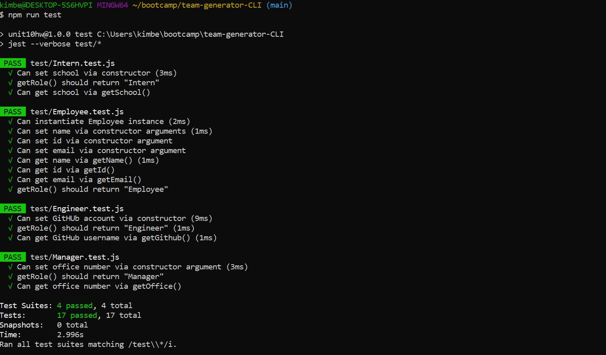

# team-generator-CLI
software engineering team generator command line application

## Table of Contents
* [Description](#description)
* [Installation](#installation)
* [Usage](#usage)
* [Credits](#credits)
* [License](#License)

## Description
Create a generator that takes in user input for the team manager and then asks for information on the team members. There should always be a manager and then any number of team members whether their role is engineer or intern. There are also tests that will need to be passed in order to validate that the methods/functions are correct.

## Installation

To create this generator I required in the inquirer npm package to allow me to prompt the user for input. An array of questions was then created which would then be called when the user ran a node app.js in their terminal. Upon completion of the questions the htmlRendere.js that was provided was used along with the writeToFile method to generate a html file. 

The dependencies are, [jest](https://jestjs.io/) for running the provided tests, and [inquirer](https://www.npmjs.com/package/inquirer) for collecting input from the user.

## Usage
* 
* 
* Link to Google Drive video of demo (https://drive.google.com/file/d/1sb68D2c5-sBBMN2MVsJCNHFQh3NtvBrz/view)

## Resources

* Screencastify

## License
MIT License 

Copyright (c) [2020] [Kimberley Torres]

Permission is hereby granted, free of charge, to any person obtaining a copy
of this software and associated documentation files (the "Software"), to deal
in the Software without restriction, including without limitation the rights
to use, copy, modify, merge, publish, distribute, sublicense, and/or sell
copies of the Software, and to permit persons to whom the Software is
furnished to do so, subject to the following conditions:

The above copyright notice and this permission notice shall be included in all
copies or substantial portions of the Software.

THE SOFTWARE IS PROVIDED "AS IS", WITHOUT WARRANTY OF ANY KIND, EXPRESS OR
IMPLIED, INCLUDING BUT NOT LIMITED TO THE WARRANTIES OF MERCHANTABILITY,
FITNESS FOR A PARTICULAR PURPOSE AND NONINFRINGEMENT. IN NO EVENT SHALL THE
AUTHORS OR COPYRIGHT HOLDERS BE LIABLE FOR ANY CLAIM, DAMAGES OR OTHER
LIABILITY, WHETHER IN AN ACTION OF CONTRACT, TORT OR OTHERWISE, ARISING FROM,
OUT OF OR IN CONNECTION WITH THE SOFTWARE OR THE USE OR OTHER DEALINGS IN THE
SOFTWARE.